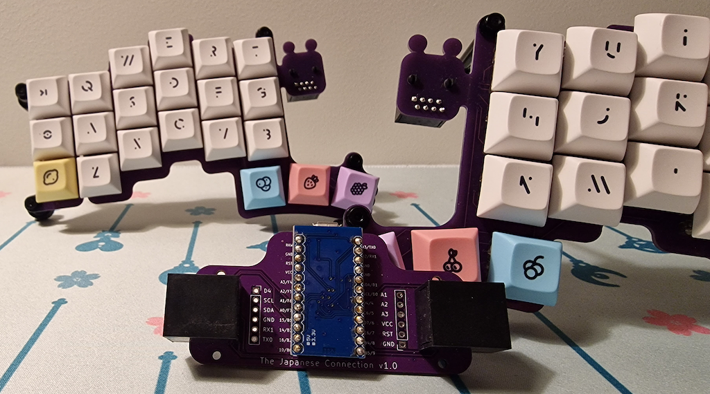
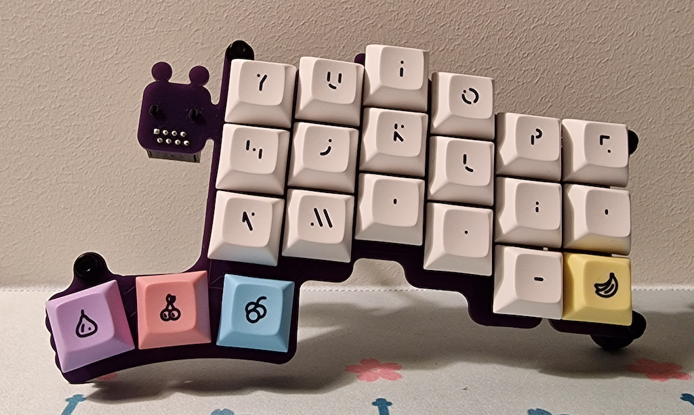

# Bartlesplit

> Bartleby is a baby Rat Creature adopted by Fone Bone and Smiley.

Bartlesplit is based on [Cheapino](https://github.com/tompi/cheapino) by Tompi.
The original idea was to build a Cheapino with hot swaps, but it evolved into something more!

At the same time I was working on Bartlesplit, a friend of mine suggested that we try to make a splithub, letting us avoid having the Pro Micro directly on the board.
This is mostly a design choice, as it means you need to have a hub for each keyboard to avoid switching Pro Micros.
We have called the hub [The Japanese Connection](https://github.com/Kyrremann/the-japanese-connection) since it's relying on the Japanese duplex matrix.

One of the main feature of the board is the built-in tenting, so you don't need to make a case to get simple tenting.

## v1.0 built

The first version has been built, and except for the diodes on the right split needed to be flipped, everything works as expected!
Break off parts was easy to remove and then sand down the bits sticking out.
I haven't tried to break away the sixth column yet, and it will probably be a bit harder, as I only used one hole for the mouse bits.

## Render

